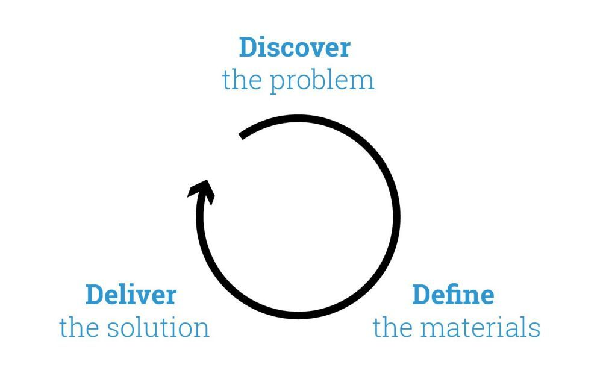

### 笔记说明

["Cloud Native Strategy"](https://www.cncf.io/wp-content/uploads/2017/11/Cloud-Native-Strategy-CNCF-1-1.pdf) 这个Slides来自 Jamie Dobson，时间是 2017-02。

### Strategy

何时使用策略：

- 超越组织边界。
- 组织缺乏关键能力。
- 创造赢家和输家。 （还有抵抗）

元素：

- 目标建立在更大的故事中
- Situational Awareness:情境意识
- Now and the future: 现在和将来
- Coalitions: 联盟
- Self-Supporting Actions: 自我支持行动
- Risk: 风险
- Courage: 勇气

> A strategy is a way through a difficulty, an approach to overcoming an obstacle, a response to a challenge.
>
> Strategy可是是克服困难的一种方式，也可是是克服障碍的一个方法，是一个对挑战的回应。

鹅和金蛋

- Microservices.
- Highly available.
- Two pizza teams.
- Auto-Scaling.
- Load Balancing.

备注：这一段每太看懂要说啥。

## 经验教训

- Lesson #1 - Don’t Steal Ideas But Rather：不要窃取想法，而是
- Lesson #2 - Steal The Processes That Created Those Ideas：而是窃取创造这些想法的流程

这个说法非常有道理。

- Lesson #3 - Define the Problem You Are Trying to Solve ：定义要解决的问题

这张图倒是很有借鉴意义，cloud native 的能力，分组方式。

- Infrastructure is Programmable：基础设施是可编程的
- System Shape== Organisational Shape：系统形状==组织形状

摸着石头过河：

- Risk and Uncertainty： 风险和不确定性
- Current Advantage： 目前的优势
- Potential Actions： 潜在行动

- Lesson #4 - In Great Uncertainty Take Smaller Steps： 在有巨大的不确定性的情况下，小步前进

Triple D 的概念：

1. 发现问题
2. 定义材料
3. 发布解决方案

Lesson #5 - The Quicker The Cycle Time The Quicker You Learn：循环时间越快学的越快

反模式：

Anti-Pattern #1 - Goal Heavy, Action Light： 目标重，动作轻
Anti-Pattern #2 - Doing Two Things At Once：同时做两件事情
Anti-Pattern #3 - Not Finishing What You Start：开始但不结束

这个三个反模式讲的很好。后面还有一个反模式：

Anti-Pattern - Stealing People’s Ideas. AKA Being Extremely Stupid. And Unoriginal. 窃取其他人的想法，十分愚蠢，不是原创

继续lesson：

Lesson #6 - In Times of Great Uncertainty Buy Knowledge：在有巨大的不确定性的情况下，购买知识

●Lesson #7 - Knowing When To Use Strategy：知道该何时使用策略

这里出来一个daniel pink的关于dive 驱动力的图：

Appendix - Other Useful Models 这里的附录有一些模型。

### Autonomy, Mastery 和 Purpose 框架

查了一下，Pink的 Autonomy, Mastery 和 Purpose 框架，参考 https://www.mindtools.com/pages/article/autonomy-mastery-purpose.htm

根据Pink的说法，内在动机基于三个关键因素：自主，征服和目的

#### autonomy/自主

是知道自己生活和工作的需要。要充分激励，您必须能够控制自己的工作，做什么以及做谁。

据Pink说，自主性激励我们创造性地思考，无需遵守严格的工作场所规则。通过重新思考传统的控制理念 - 正常的办公时间，着装规范，数字目标等 - 组织可以增加员工的自主权，建立信任，并改善创新和创造力。

软件公司经常使用自主激励，其中许多公司让他们的工程师有时间在他们自己的开发项目上工作。这使他们可以自由地尝试和测试新想法，这可以为组织带来好处，例如改进的流程或创新的解决方案。

#### mastery/征服

征服是改善的愿望。如果你受到征服的激励，你可能会发现自己的潜力是无限的，并且你会不断寻求通过学习和练习来提高你的技能。寻求征服的人需要为了自己的利益而获得它。

例如，以征服为动力的运动员可能希望尽可能快地跑步。她收到的任何奖章都不如持续改进的重要性。

#### purpose/目的

如果人们不了解或不能投身于“bigger picture”，他们可能会在工作中脱离接触并失去动力。

但那些相信自己正在努力做出比自己更大更重要的事情的人往往是最勤奋，最富有成效和最积极的人。所以，鼓励他们找到他们工作的目的 - 例如，通过使用OKR或OGSM将他们的个人目标与组织目标联系起来 - 不仅可以赢得他们的思想，也可以赢得他们的心灵。

例如，为员工提供利用他们的技能使当地非营利组织受益的机会可以培养强烈的目标感。正如开发以价值观或道德为导向的公司愿景一样，鼓励人们“购买”其关键的组织目标。

