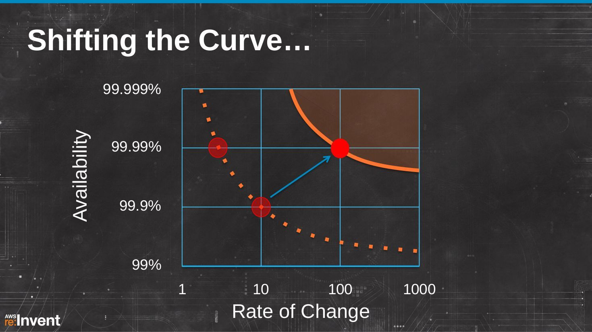

### 说明

[Netflix Development Patterns for Scale, Performance & Availability](https://www.slideshare.net/AmazonWebServices/dmg206) ，来自Netflix，2013年，应该是第一次提出 Cloud Native 的概念吧？

### 笔记

这页好像很有历史意义，猜测是第一次出现 Cloud native ：

Cloud Native：

- Service oriented architecture：2013年还是SOA，当时还没有微服务的概念
- Redundancy
- Statelessness：无状态对扩展实在是太重要也太方便了
- NoSQL：2013年nosql是大热
- Eventual consistency：最终一致性的实践倒是挺早

按照规模和变更频率划分为四种类型：

1. enterprise IT：规模小，变化慢，所以容易处理
2. 电信：规模大，变化慢，主要应对硬件失败
3. 初创公司：规模小，变化快，主要应对软件失败
4. 网络规模：规模大，变化快，软硬件或者说所有东西都会出问题

Netflix Cloud Goals:

- Availability：可用性优先考虑，4个99（99.99%）
- Scale：然后是可扩展性
- Performance：再是性能

可用性的复合，当服务依赖增加时，可用性下降。

为了在有1000个组件的请求下达到4个九：

- 如果组件失败会导致系统失败，则要求每个组件达到6个9
- 或者，如果组件失败可以降解而不是导致系统失败，则可以隔离非依赖

但是，Availability, Scale, Performance 是不够的!

快速迭代，提高变更率，而变更会导致bug，变更频率会影响可用性。

可用性和变更率之间的妥协: 当变更率增加时，可用性下降。

如果要提高可用性，就要降低变更率。

而要改变曲线，同时实现提高可用性和增加变更频率。

这就必须打破导致级联系统失败的级联依赖，实现子系统隔离: 让失败只发生在一个组件中，而绝不导致级联系统失败。

而子系统隔离需要实现：

- 具备超时和故障转移能力的冗余系统：当超时时可以有默认相应作为fallback
- 金丝雀推出 （Canary Push）
- Red/Black 部署：应该就是现在常说的蓝绿部署
- Standby Blue system：待机蓝色系统，应该指冷备、热备之类
- Zone isolation：区域隔离，以应对基础设施失败，如电力故障
- Region isolation：地域隔离，通过DNS切换region，然后一个region下再有两个zone

子系统隔离的总结，不得不说netflix厉害，2013年就做的这么成熟。

