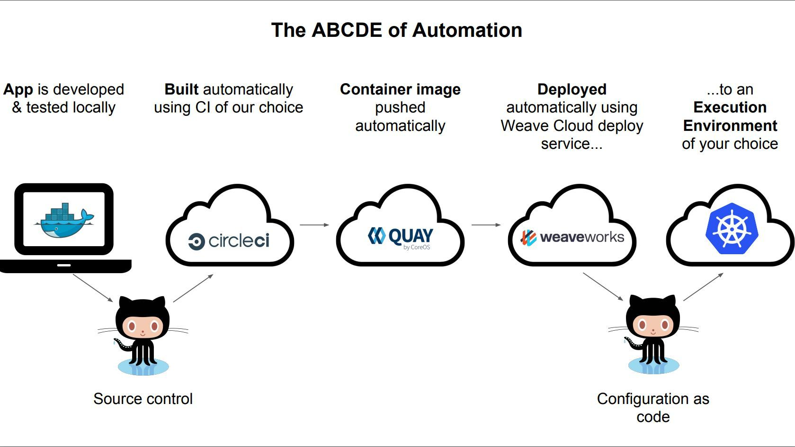

### 笔记说明

["What is Cloud Native and why should I care"](https://www.cncf.io/wp-content/uploads/2017/11/What-is-Cloud-Native-CNCF-Webinar-23-Feb-2017-1.pdf) 这个Slides来自 Alexis Richardson ，他是 CNCF TOC Chair & CEO Weaveworks，时间是 23 Feb 2017。

### Weave的解决方案

Netflix率先将云原生作为一种实用工具，这里有一个重要的slides [Netflix Development Patterns for Scale, Performance & Availability](https://www.slideshare.net/AmazonWebServices/dmg206) ，来自Netflix，2013年，应该是第一次提出 Cloud Native 的概念吧？

Weave Cloud 业务需求：

- 24-7-365, 全球，多租户，安全等
- 团队100%专注于快速应用开发，而不是VM管理和维护
- 我们可以根据使用/成本来增加/减少组件
- 不在接线上花钱（Prometheus只适用于Docker，Kubernetes ..）
- 我们可以在任何地方运行Weave Cloud应用程序（开源而不仅仅是亚马逊）

我们的解决方案经验：对我们最重要的是什么？

1. 自动化：很多自动化。端到端。自动化所有事情。

    如：CI / CD！编排！可观测性！

2. 需要关注应用而不是基础设施，例如使用随时随地都能正常工作的标准包装，如容器！

3. 需要了解并应用新的云原生模式和工具，以用于监控，日志，正常运行时间管理等，如微服务及其他！

这里有一个非常有意思的自动化实践，ABCDE：

- App is developed & tested locally：本地开发和测试应用，这个对开发效率有非常大的帮助，的确很重要。
- Built automatically using CI of our choice：使用我们选择的CI进行自动构建
- Container image pushed automatically：自动推送容器镜像
- Deployed automatically using Weave Cloud deploy service...：使用Weave云部署服务自动部署
- ...to an Execution Environment of your choice：部署到选择的执行环境

### 经验教训

Cloud Native需要很好的工具：

- 开源
- 随处运行
- 可信赖的软件，由可靠的团队和流程管理
- 易于监控和控制
- 与其他工具互操作，以通用惯例的方式

基础设施必然是枯燥乏味的：

- 要专注于您的应用，基础设施必须是枯燥乏味的
- 使用容器
- 使用PaaS/CaaS或您喜欢的任何容器平台
- 注意1％的故障问题

我们需要良好的模式：

- 微服务（和Microliths）

- Cattle not Pets：是奶牛不是宠物
- 可观察性和控制性
- 通信模式 - 蓝/绿，金丝雀，智能路由和负载均衡......

> Cattle not Pets 算是行业术语，或者典故了，具体解释见 https://devops.stackexchange.com/questions/653/what-is-the-definition-of-cattle-not-pets

### Cloud Native是模式

模式用来干嘛：通过向他人学习来避免痛苦

- Availability/可用性：Microservices & Netflix for everyone

- Automation/自动化： Deployment & Management
- 促进 CI/CD & 自动化的“ABCDE” 
- 任何地方! Containers 是可移动的

### 通用开源软件

- Software is eating the world
- Open Source is eating Software
- Cloud is eating Open Source

如果没有通用开源软件，我们将冒着Cloud锁定的风险。

Appendix 中的 cloud native 层次关系分析非常有意思。

