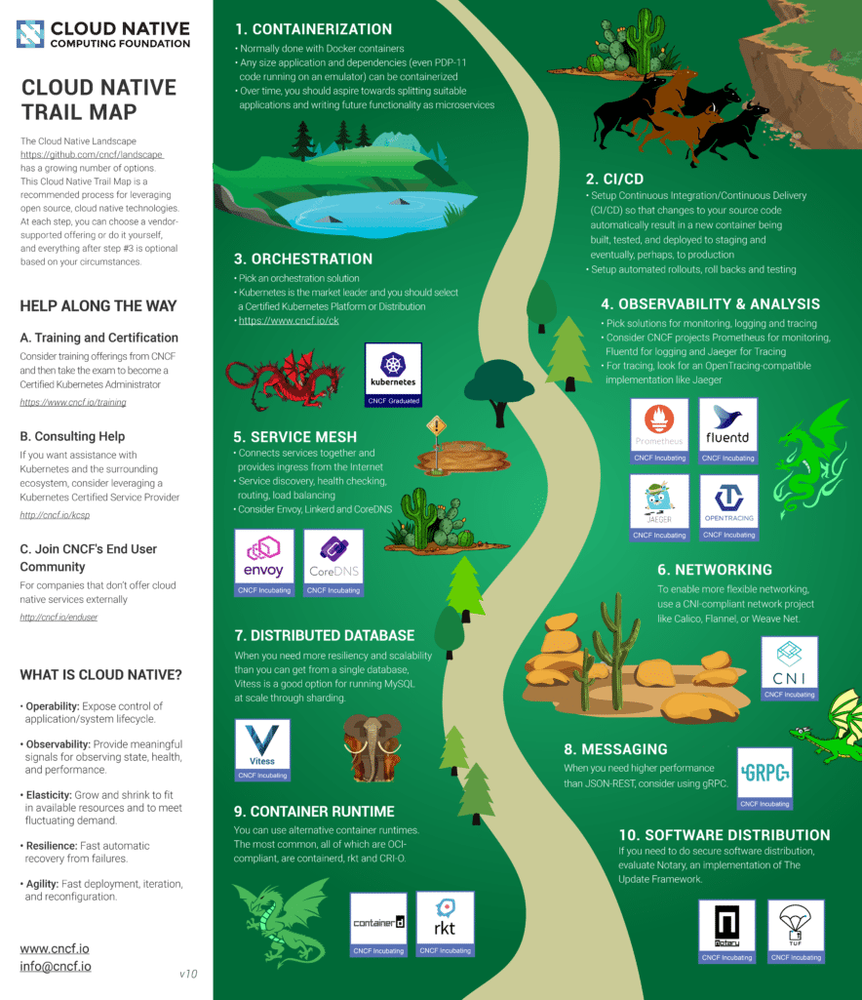

### 说明

[Evolving Cloud Native Landscape](https://events.linuxfoundation.org/wp-content/uploads/2018/09/Evolving-Cloud-Native-Landscape-Dec-2018-ContainerDays-Japan.pdf) ，来自 Chris Aniszczyk ，CTO of CNCF。

### 笔记

Chris Aniszczyk 介绍：

- CTO/COO, Cloud Native Computing Foundation (CNCF)
- Executive Director, Open Container Initiative (OCI)
- VP, Developer Relations, Linux Foundation (LF)

> 备注：好像之前来杭州和蚂蚁谈合作的是这位，待查证。

What is Cloud Native? Definition v1.0

https://github.com/cncf/toc/blob/master/DEFINITION.md

现在这个定义有中文版本了。

为何采用云原生：

1. 更好的资源效率，可以用较少的服务器上运行相同数量的服务
2. 云原生基础架构可实现更高的开发速度 - 更快地改善您的服务 - 降低风险
3. 云原生允许多云（在公共云之间切换或在多个云上运行）和混合云（在数据中心和公共云之间移动工作负载）

Cloud Native Trail Map

Cloud Native Trail Map为企业开始云原生之旅提供了概述。

图片来自这里：[Introducing The Cloud Native Landscape 2.0 – Interactive Edition](https://www.cncf.io/blog/2018/03/08/introducing-the-cloud-native-landscape-2-0-interactive-edition/), 清晰原图请见 https://github.com/cncf/landscape#trail-map (大概4M)

What Have We Learned?

- 核心构建块:
	Servers ➡ Virtual Machines ➡ Buildpacks ➡ Containers
- 隔离单元:
	从重量级到轻量级
- 不可变性:
	From pets to cattle
- 供应商:
	从闭源单供应商到开源跨供应商

IoT + Edge + Kubernetes

物联网 + 边缘计算 + Kubernetes，应该是一个好大的市场。

简单描述了这些场景，有需要时再来看吧，暂时用不上：

- Kubernetes: IoT+Edge Working Group
- KubeEdge: Kubernetes + Edge Nodes
- Serverless + Nodeless

