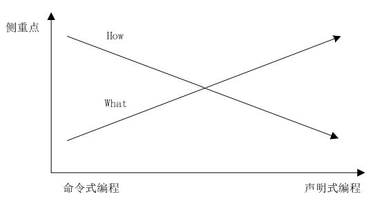

## 介绍

什么是Declarative？

[Declarative](https://en.wikipedia.org/wiki/Declarative_programming)（声明式设计）指的是这么一种软件设计理念和做法：我们向一个工具描述我们想要让一个事物达到的目标状态，由这个工具自己内部去figure out如何令这个事物达到目标状态。

和Declarative（声明式设计）相对的是[Imperative](https://en.wikipedia.org/wiki/Imperative_programming)或Procedural（过程式设计）。两者的区别是：在Declarative中，我们描述的是目标状态（Goal State），而在Imperative模式中，我们描述的是一系列的动作。这一系列的动作如果被正确的顺利执行，最终结果是这个事物达到了我们期望的目标状态的。

声明式和命令式是两种截然不同的编程方式:

- 在命令式 API 中，我们可以直接发出服务器要执行的命令，例如： “运行容器”、“停止容器”等；
- 在声明式 API 中，我们声明系统要执行的操作，系统将不断向该状态驱动。



我们常用的 SQL 就是一种声明式语言，告诉数据库想要的结果集，数据库会帮我们设计获取这个结果集的执行路径，并返回结果集。众所周知，使用 SQL 语言获取数据，要比自行编写处理过程去获取数据容易的多。

我们来看看相同设计的 YAML，利用它，我们可以告诉 Kubernetes 最终想要的是什么，然后 Kubernetes 会完成目标。

以下是 etcd 的 operator：

```yaml
apiVersion: extensions/v1beta1
kind: Deployment
metadata:
  name: etcd-operator
spec:
  replicas: 1
  template:
    metadata:
      labels:
        name: etcd-operator
    spec:
      containers:
      - name: etcd-operator
        image: quay.io/coreos/etcd-operator:v0.2.1
        env:
        - name: MY_POD_NAMESPACE
          valueFrom:
            fieldRef:
              fieldPath: metadata.namespace
        - name: MY_POD_NAME
          valueFrom:
            fieldRef:
              fieldPath: metadata.name
```

## 优点

声明式 API 使系统更加健壮，在分布式系统中，任何组件都可能随时出现故障。当组件恢复时，需要弄清楚要做什么，使用命令式 API 时，处理起来就很棘手。但是使用声明式 API ，组件只需查看 API 服务器的当前状态，即可确定它需要执行的操作。

声明式设计的好处是：

1. **简单**。我们不需要关心任何过程细节。过程是由工具自己内部figure out的、内部执行的。
2. **self-documentation**，因为我们描述的就是希望一个事物变成什么样子，而不是“发育”过程。


## 总结

Declarative是一种设计理念，是一种工作模式，透传出来的是“把方便留给别人，把麻烦留给自己”的哲学。Declarative模式的工具，设计和实现的难度是远高于Imperative模式的。作为用的人来说，Declarative模式用起来省力省心多了。


### 参考资料

- 吾道一以贯之--天基风险防范的理论和实践
- Declarative简介