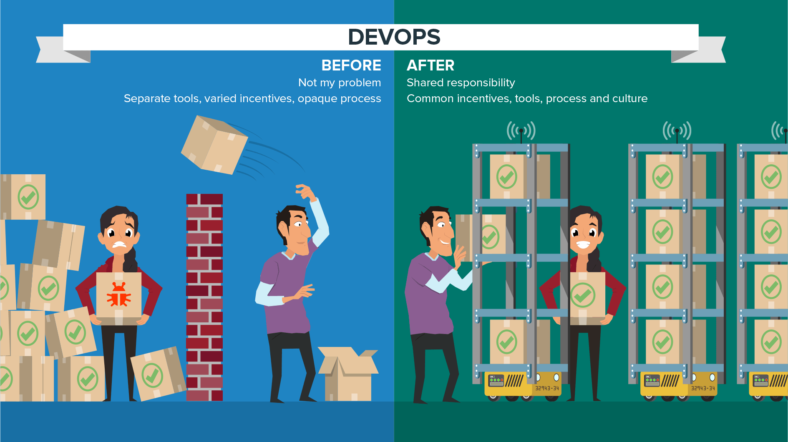

DevOps

DevOps是开发和运维的合作，目标是自动化软件交付和基础设施更改过程。它创造了一个文化和环境，让构建，测试和发布软件可以快速，频繁，更可靠地发生。

持续交付 让单个应用随时处于可发布状态，而不用等待与其他变更绑定到一次发布中。持续交付使得发布变成一个频繁且平常的过程，因此组织可以以更低的风险经常交付，并从最终用户获得更快的反馈，直到部署成为业务流程和企业竞争力的重要组成部分。

