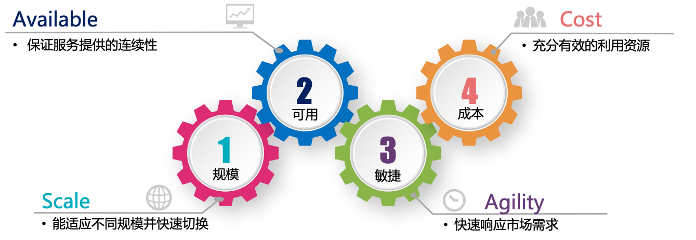

### 云原生的特征列表

在前面我们将云原生的目标分解为四个核心目标：

现在将这四个云原生核心目标拆解为多个云原生特性：

| 特征                     | 规模（Scale） | 可用（Available） | 敏捷（Agility） | 成本（Cost） |
| ------------------------ | ------------- | ----------------- | --------------- | ------------ |
| 隔离性(Isolation)        | ✔️             | ✔️                 | ✔️               |              |
| 模块化(Modularity)       | ✔️             |                   | ✔️               | ✔️            |
| 可组合(Composable)       |               |                   | ✔️               | ✔️            |
| 容器化(Containerized)    | ✔️             |                   | ✔️               | ✔️            |
| 弹性(Resiliency)         | ✔️             | ✔️                 |                 |              |
| 可替换性(Replaceability) | ✔️             | ✔️                 |                 |              |
| 自动化(Automation)       | ✔️             | ✔️                 | ✔️               | ✔️            |
| 可观测性(Observability)  |               | ✔️                 | ✔️               |              |
| 可测试性(Testability)    |               | ✔️                 | ✔️               |              |
| 可移植性(Portability)    | ✔️             | ✔️                 |                 | ✔️            |
| 安全(Security)           |               | ✔️                 |                 |              |
| 移动性(Mobility)         | ✔️             |                   |                 |              |

