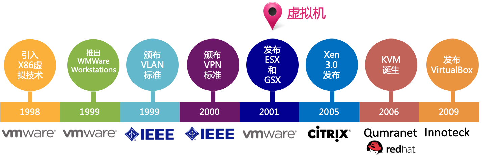
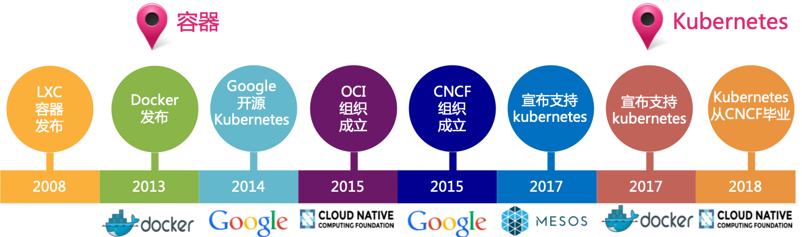
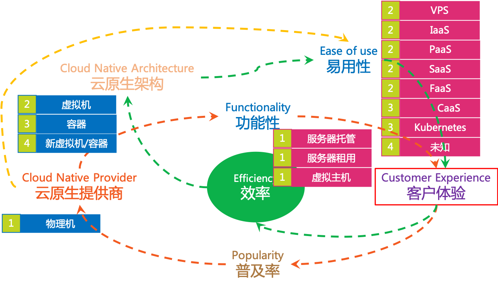
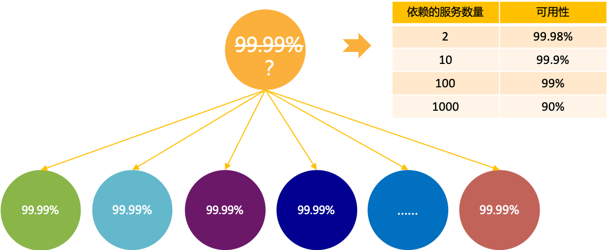
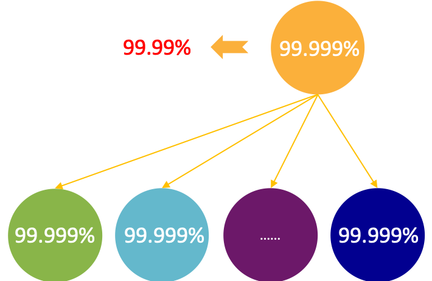

隔离性是云计算的最基本的特征。

## 系统层面的隔离性

云计算中分享的计算能力、网络能力、存储能力，都必须以某种方式实现隔离，才可以提供给客户（或者说租户）使用。

而云原生应用也要求与物理机器和操作系统解耦，理论上说，云原生应用是在更高的抽象级别（即云）上运行，和物理机器和操作系统不应该有直接的依赖关系。

### 虚拟化技术的历史

系统层面隔离性的实现直接依赖于虚拟化技术。虚拟化技术是云计算的最重要的也是最关键的基础技术：没有虚拟化技术，隔离性和云计算都无从谈起。

在云计算的历史上，虚拟化有两个关键技术出现，都极大的推动了云计算的发展：

1. 虚拟机（Virtual Machine）技术

	

2. 容器（Container）技术

	

### 虚拟化技术的飞轮

在虚拟机技术出现之前的物理机时代，客户需要直接面对物理机器，比如自行购买机器、安装操作系统、搭建机房、准备网络等。当然也出现了一些改善型的服务，比如服务器托管就免除了机房和网络的工作，而服务器租用则将购买服务器变成了租用服务器，但原则上用户依然是需要面对物理机器。

后来通过在服务器软件（比如说在web应用服务器如Apache、IIS）之上，提供虚拟主机服务，容许用户运行静态网站、或者PHP、ASP等脚本语言，一定程度上实现了有限的隔离性。

虚拟机技术出现之后，基于虚拟机技术（尤其是成熟后的Xen、KVM等）的 VPS 可以提供更多的功能，带来更好的客户体验，更充分的利用物理机器的资源。之后基于虚拟机技术的云计算模式一路发展，IasS/PaaS/SaaS/FaaS 相继出现并成熟。

虚拟机技术有非常好的隔离性，但相对较重，在 LXC、cgroup 等技术发展成熟后，基于共享内核的容器技术出现，由于轻量高效的特点迅速普及，CaaS  出现，IasS/PaaS/SaaS/FaaS 等也随即从基于虚拟机转为基于容器。之后以 Kubernetes 为代表的容器编排技术更是将容器的优点充分发挥。

但从隔离性上说，容器技术由于共享Liunx内核，在隔离性上始终存在不足，而传统虚拟机技术和容器相比又显得太重。最近，以 gvisor 和 kata container 为代表的新型虚拟机/容器技术正在迅速发展，目标是希望能融合虚拟机/容器的优点。目前这些技术还在早期发展阶段，尚未普及。未来会带来什么样的新变化，值得期待。

## 子系统间的隔离性

当单个应用程序，通过模块化技术（如微服务）拆解为多个相互调用相互协作的服务之后，就出现了子系统之间隔离性的要求。

如图所示，假定当前系统中所有服务的可用性就是99.99%，那么多一个服务依赖多个服务（包括级联依赖），由于被依赖的服务可能失败，因此当前服务的可用性是无法维持在99.99%的，而是随着服务依赖的数量增加而下降：

从实际情况看，通常服务有10个左右的依赖服务（注意包括级联依赖）是很正常的，某些特殊的服务有100个左右的依赖服务也是可能的，而这种情况下，服务的可用性会直接下降到99.9%和99%。

因此，为了达到可用性的目标，将最终的可用性维持在99.99%，有两个方法：

1. 提供每个组件的可用性：要求每个组件的可用性上升一个等级，比如达到99.999%，很明显这个难度很大，尤其成本会无法控制

	

2. 隔离发生故障的组件：

	打破导致系统失败的级联依赖，实现子系统隔离: 让失败只发生在一个组件中，而不导致级联系统失败。

	

而子系统隔离需要实现：

- 主动/被动健康检查：排除不健康的实例
- 熔断、重试、超时
- 服务失败时提供fallback
- 金丝雀推出 （Canary Push）
- 蓝绿部署：应该就是现在常说的蓝绿部署
- 灰度发布：先小范围试错，验证OK再全面上线
- Zone Isolation：区域隔离，以应对基础设施失败，如电力故障
- Region Isolation：地域隔离，通过DNS等技术手段切换Region

