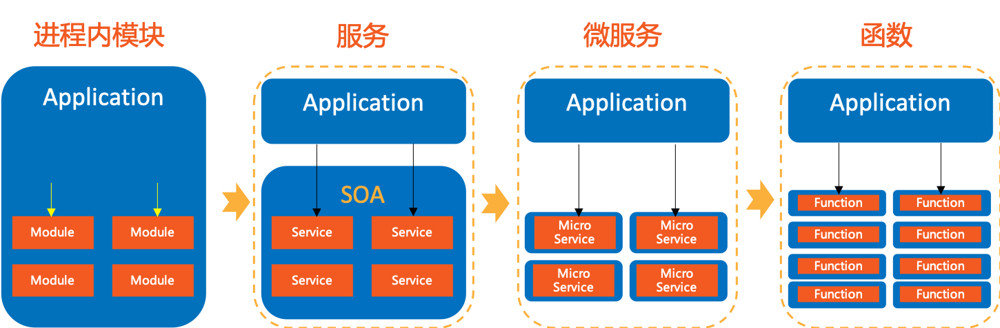
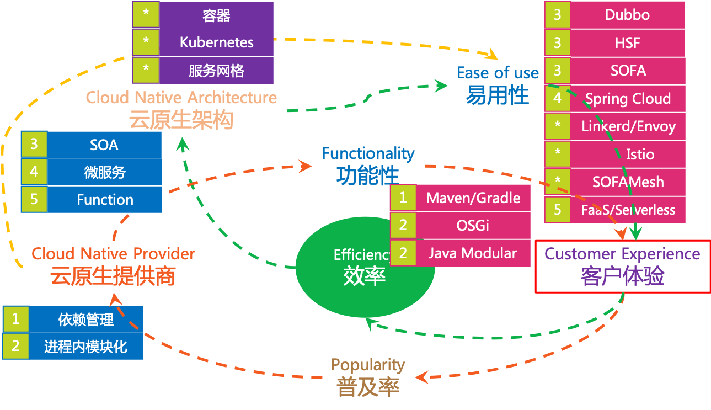

### 模块化的理念

在软件设计中，模块化是管理系统复杂度的重要手段。随着应用程序规模的增大，复杂性越来越高。为了降低应用的复杂度，增加代码重用，需要将应用分解为更小更易于理解的部分。实践中，我们通常将应用程序按照功能的不同划分为独立但相互协作的部分，称为“模块”。

模块是可以部署、管理、重用和组合的单元，多个模块相互协作，组成完整的应用程序，对外提供功能和服务。

### 模块化的演进

模块化技术由来已久，早不是新的概念，而对于云原生应用来说模块化尤为重要：云原生架构从诞生开始就以SOA、微服务等方式在践行模块化，近年来还出现了Function规模的模块。

我们来看一下模块化的演进过程：

可以清晰的看到，模块化的演进方向是**模块的粒度越来越小**。

### 模块化技术的飞轮

结合飞轮理论来细致的追溯模块化演进过程中的粒度变化带来的技术发展：

1. 进程内模块：早期的模块化更多的是关注如何拆解系统为多个子系统，拆分功能模块为类库、动态链接库等可重用机制，为了更好的管理这些拆分出去的功能模块，实现组合和重用，还建立了非常完备的依赖管理体系，如Java中我们非常熟悉的Java Maven、Gradle等。

	此时的模块只是在打包、发布时独立存在，应用程序运行起来之后就被应用程序加载，隔离性并不好。因此后来出现了加强进程内模块隔离和管理的思路，出现了典型如 OSGi 技术和 Java9 中引入的 Modular 技术。

	由于模块都在同一个进程内，因此此时对模块的调用都是方法调用。

2. 服务：后面出现SOA架构，提倡服务化，即将模块以服务的方式从应用进程中分离除去并独立部署，应用以远程调用的方式调用SOA服务提供的公共API。SOA架构在进程层面将应用分解，通过对SOA服务的组合和重用来满足应用的需求。SOA时代，产生了一系列非常优秀的服务化框架如dubbo/HSF/SOFA等。

3. 微服务：在SOA长期实践的基础上，微服务的理念产生，除了颗粒进一步缩小，还要求不同的微服务也要进程分离，同时为了满足高内聚的要求，对数据库等内在资源的访问也要求隔离。微服务时代，出现了大家熟悉的spring cloud。

	在微服务理念出现时，正值容器技术出现，微服务+容器的组合相互促进成为市场热点。后面service mesh理念出现，k8s等容器编排系统成熟，service mesh + k8s成为微服务+容器组合的升级版本。

4. 函数：再进一步，将模块的颗粒缩小到函数级别，配合FaaS、Serverless平台使用。

### 微服务

微服务在云原生中的重要性，我们可以从前面云原生的定义中感受到：所有方式的云原生定义，都会将微服务作为重点。甚至在很多强调模块化的地方，都会明确指明微服务。

可以说，微服务是云原生中模块化最典型的实现模式。

### 参考资料

- [Modularity – Proposal for achieving functional decomposition](https://wiki.onap.org/download/attachments/25434845/Modularity-FunctionalDecomposition_Draft_v09.pdf?version=1&modificationDate=1529992394000&api=v2)