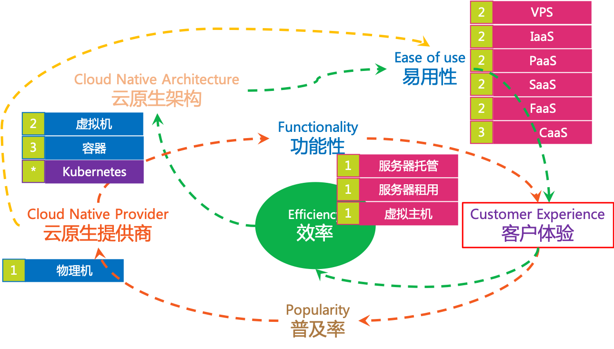
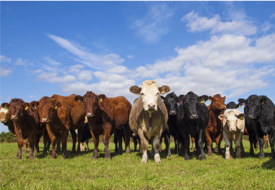

### 可替换性的由来

可替换性和虚拟化技术密切相关，当应用运行的平台从物理机到虚拟机再到容器，然后配合自动化技术，尤其是Kubernetes这种功能强大的成熟的容器编排平台，创建和销毁一个应用的速度和开销都很理想。加上容器和镜像带来的不可变性，如果应用本身是无状态的，那么这个应用就可以非常容易的做到随意替换任何一个运行中的实例。

虽然说在物理机和虚拟机时代实现类似的可替换性也是有办法的，但是毫无疑问的是在容器时代实现可替换性要简单和实用的多。“容器化 + 自动化 + 不可变性 + 无状态” 为可替换性带来了巨大的实用价值。

### Pets vs. Cattle

关于可替换性，有一个非常流行的谚语：“Pets vs. Cattle”，宠物和奶牛（或者直白一点翻译为 牲口 更容易理解）。

援引一段对Pets(宠物)的解释：

> Servers or server pairs that are treated as indispensable or unique systems that can never be down. Typically they are manually built, managed, and “hand fed”. Examples include mainframes, solitary servers, HA loadbalancers/firewalls (active/active or active/passive), database systems designed as master/slave (active/passive), and so on.
>
> 服务器或服务器对，被视为必不可少或独一无二的系统，永不停机。通常，它们是手动构建，管理和“手工伺候”的。示例包括大型机，单独服务器，HA负载均衡器/防火墙，设计为主/从的数据库系统等。

援引一段对Cattle(奶牛/牲口)的解释：

> Arrays of more than two servers, that are built using automated tools, and are designed for failure, where no one, two, or even three servers are irreplaceable. Typically, during failure events no human intervention is required as the array exhibits attributes of “routing around failures” by restarting failed servers or replicating data through strategies like triple replication or erasure coding. Examples include web server arrays, multi-master datastores such as Cassandra clusters, multiple racks of gear put together in clusters, and just about anything that is load-balanced and multi-master.
>
> 两个以上服务器的部署，使用自动化工具构建，专为故障而设计，其中每一台都是可以替代的，甚至两台，三台也是可以替代的。通常，在故障事件期间不需要人为干预，因为部署可以通过重新启动故障服务器或通过三重复制或擦除编码等策略复制数据来展示“故障路由”的属性。示例包括Web服务器部署，多主数据存储（如Cassandra集群），以及几乎任何负载均衡和多主机。

简单说，如何判断某个机器、服务是宠物还是牲口，只要简单评估一下：如果它发生失败无法工作，你是倾向于让它恢复，还是倾向于简单抛弃然后拿另一个替换。

### 云原生下的角色转变

在云原生时代，有一些概念发生了角色转变：有些从宠物转变为牲口，有些从牲口转变为宠物。

#### IP地址：从宠物到牲口

在云原生之前，尤其是容器技术出来之前，IP地址是非常重要的，某些情况下几乎等同于一台机器（物理机或者虚拟机）的标致，通常IP是固定的不会轻易更改，外部系统也经常是通过IP地址来实现对这个机器的访问。

而在容器时代，容器被频繁创建和销毁，容器的IP地址不再固定而是动态变化，这是IP地址已经不在适合作为标识而使用。举例，在Kubernetes中取而代之的是标签（Label）和标签选择器（Label Selector），通过诸如 "app: service-1" 这样的方式来定位目标容器

#### 端口：从牲口到宠物

TBD

### 参考资料

- [PETS VS. CATTLE](https://www.engineyard.com/blog/pets-vs-cattle)
- [PETS VS. CATTLE](https://www.engineyard.com/blog/pets-vs-cattle): By Noah Slater
- [CERN Data Centre Evolution](https://www.slideshare.net/gmccance/cern-data-centre-evolution): PPT 第17页
- [DevOps Concepts: Pets vs Cattle](https://medium.com/@Joachim8675309/devops-concepts-pets-vs-cattle-2380b5aab313)

