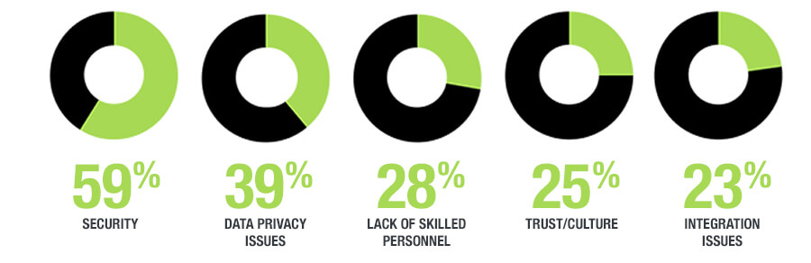

安全(Security)

It goes without saying that security is a critical part of CN applications and needs to be considered and designed for as a cross-cutting concern from the inception. Security concerns impact the design & lifecycle of CN applications ranging from deployment to updates to image portability across environments. A range of technology choices is available to cover various areas such as Application level security using Role-Based Access Control, Multifactor Authentication (MFA), A&A (Authentication & Authorization)  using protocols such as OAuth, OpenID, SSO etc. The topic of Container Security is very fundamental one to this topic and there are many vendors working on ensuring that once the application is built as part of a CI/CD process as described above, they are packaged into labeled (and signed) containers which can be made part of a verified and trusted registry. This ensures that container image provenance is well understood as well as protecting any users who download the containers for use across their environments.

毫无疑问，安全性是CN应用程序的关键部分，需要从一开始就考虑并设计为一个跨领域的关注点。安全问题影响CN应用程序的设计和生命周期，从部署到更新，再到跨环境的映像可移植性。一系列技术选择可用于涵盖各个领域，例如使用基于角色的访问控制的应用程序级安全性，多因素身份验证（MFA），使用OAuth，OpenID，SSO等协议的A＆A（身份验证和授权）.Container的主题安全性是本主题的基础，并且有许多供应商致力于确保一旦应用程序构建为上述CI / CD过程的一部分，它们被打包成带标签（和签名）的容器，这些容器可以成为经过验证和信任的注册表的一部分。这样可以确保容器图像出处得到充分了解，并保护下载容器以便在其环境中使用的任何用户。

TDWI调查还向组织询问了云分析采用的障碍。毫不奇怪，两个最重要的问题是安全性和数据隐私 - 这些问题一直困扰着云计算的采用。

Authentication systems

Applications that might have run within existing enterprise datacenters often utilized the internal corporate Microsoft Active Directory or some other identity management system to authenticate user logons. Ideally, applications hosted in a cloud should not assume Active Directory or the internal identity system is available; instead, they should favour an industry standard for authentication and directories such as LDAP, OAUTH, or SAML. These provide authentication capabilities with OAUTH and SAML a bit more robust and appropriate as part of a single sign-on (SSO) system. 

There is also a growing trend towards IaaS and SaaS identity management systems, where firms ‘outsource’ authentication and authorization to vendors when integrate at the API level with various directory protocols and identity systems [eg. Centrify and Azure EMS].

认证系统

可能在现有企业数据中心内运行的应用程序通常使用内部企业Microsoft Active Directory或其他一些身份管理系统来验证用户登录。理想情况下，  托管在云中的应用程序不应假定Active Directory或内部标识系统可用 ; 相反，他们应该支持行业标准的身份验证和目录，如LDAP，OAUTH或SAML。这些提供OAUTH和SAML的身份验证功能更加健壮，适合作为单点登录（SSO）系统的一部分。 

IaaS和SaaS身份管理系统也呈增长趋势，当API级别与各种目录协议和身份系统集成时，公司将认证和授权外包给供应商[例如。Centrify和Azure EMS]。

