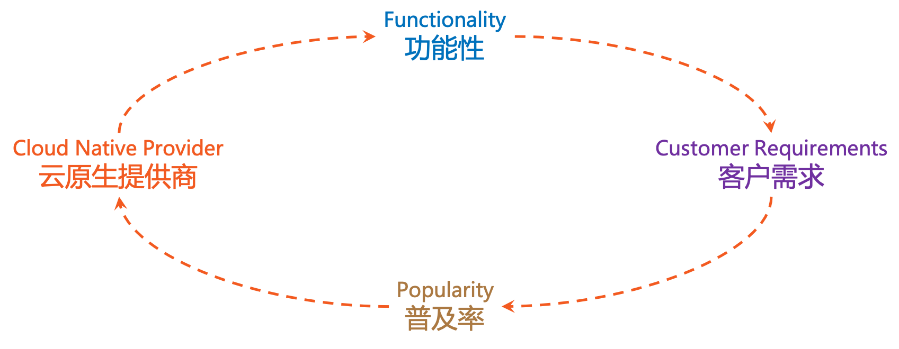
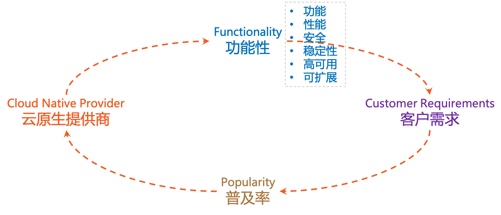
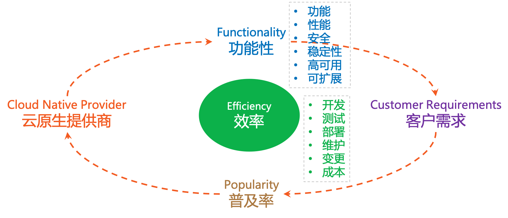
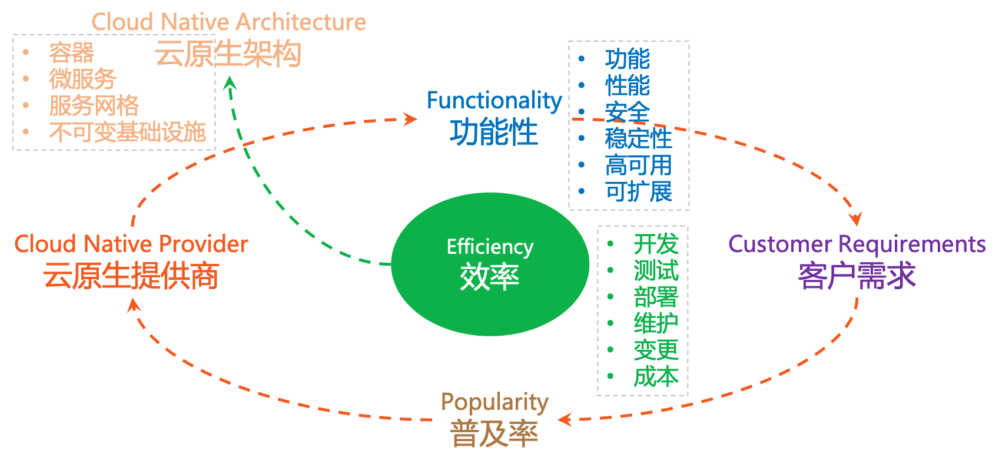
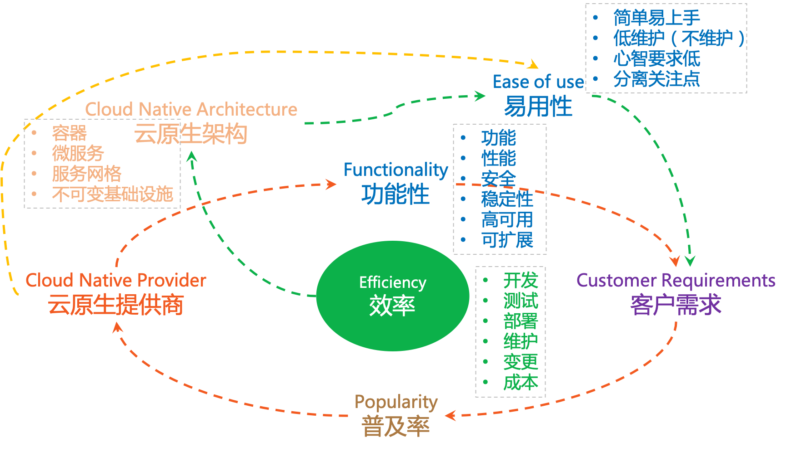
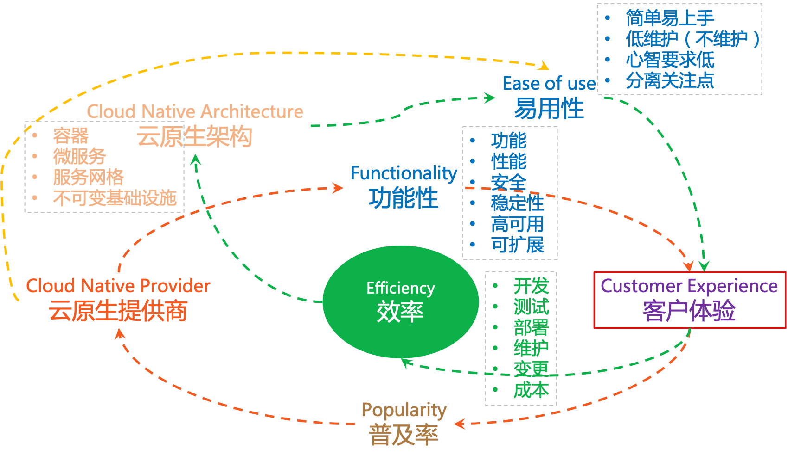
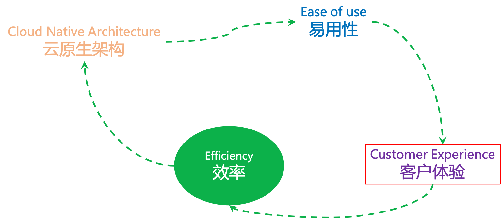
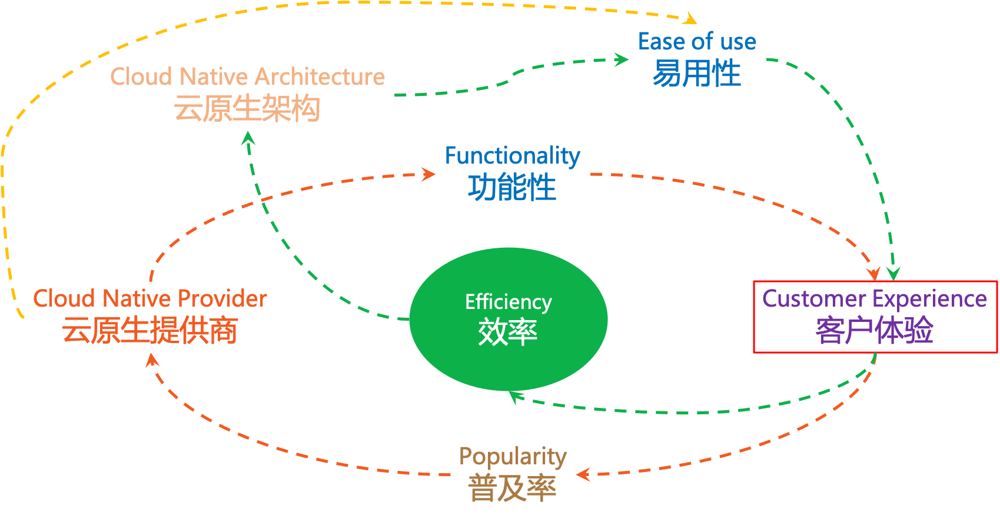

### 在云原生之前

在云原生出现之前，软件开发领域存在如下图的基本循环：

- 软件供应商开发软件产品
- 产品提供各种功能
- 这些功能可以满足客户的需求
- 于是有更多的客户使用这些产品，产品普及率的增加会带来更多利润，促使软件开发商继续改进产品和加强功能

在这个闭环中，迭代速度通常并不快（典型如大型电信产品一年只做一两次大版本发布），用户规模也比较小（除了电信软件，和目前移动互联网时代相比有一到两个数量级的差异），因此客户（包括开发、测试、运维、市场运营等）需求主要集中在产品的功能性。

### 云原生时代的新挑战

随着互联网，尤其是移动互联网的发展，用户规模剧增，对功能性的要求急剧增加：

而在满足功能之外，对效率的要求更加迫切：需要在开发、测试、部署、运维等几乎所有环节都大幅提升工作效率，以快速变更来实现对市场的快速响应，同时还必须尽量控制成本：

对速度和成本的追求催生了云计算市场，并一步一步演进到云原生架构，出现了容器、微服务、服务网格、不可变基础设施等技术和理念：

云原生架构，不仅仅体现在功能性方面的进一步改善和加强，而且在易用性方面有了质的飞跃：

最终，云原生不仅仅在功能性方面可以满意客户需求，还通过改善易用性极大的提升了客户体验。在下图中，我们将客户需求升级为客户体验。而良好的用户体验，会直接帮助客户提升各种效率：

因此，在原有的闭环之外，云原生还形成了一个新的闭环：

- 通过云原生架构，在功能性之外提供易用性
- 通过提供易用性，提升客户体验
- 提供提升客户体验，来帮助客户提高效率
- 而效率的持续改进，会促使云原生架构进一步演进，出现更多易用性更好的理念和技术，云原生提供商也愿意加强产品易用性方面的表现

最终，在云原生时代，以客户体验为中心，形成功能性和易用性两个闭环：

