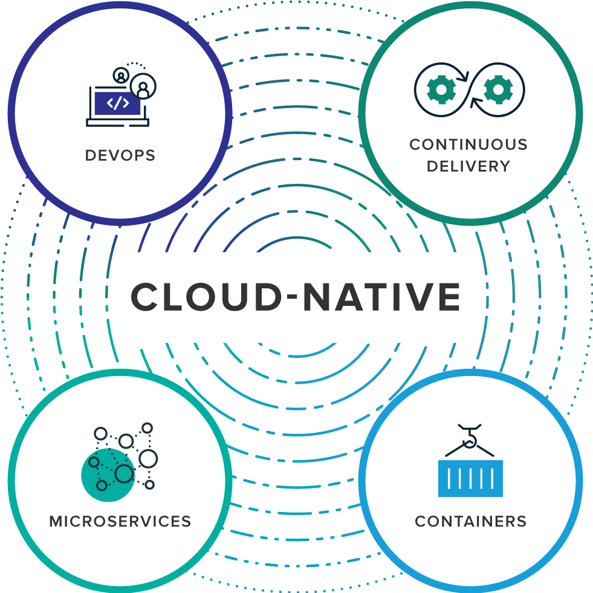

## 云原生定义

云原生是一种专门针对云上应用而设计的方法，用于构建和部署应用，以充分发挥云计算的优势。这些应用的特点是可以实现快速和频繁的构建、发布、部署，结合云计算的特点实现和底层硬件和操作系统解耦，可以方便的满足在扩展性，可用性，可移植性等方面的要求，并提供更好的经济性。同时通过拆解为多个小型功能团队来让组织更敏捷，让人员、流程和工具更好的结合，在开发、测试、运维之间进行更密切的协作。

但是当需要回答“什么是云原生”这个问题时，还是会有些困难：在过去几年间，云原生的定义一直在变化和发展演进，不同时期不同的公司对此的理解和诠释也不尽相同，因此往往会带来一些疑惑和误解。

我们一起来看看云原生定义在不同时期的变化。

### Pivotal的定义

Pivotal 是Cloud Native/云原生应用的提出者，并推出了Pivotal Cloud Foundry和Spring系列开发框架，是云原生的先驱者和探路者。

2015年，来自Pivotal公司的Matt Stine编写了一本名为 迁移到云原生应用架构 的电子书，提出云原生应用架构应该具备的几个主要特征：

- 符合12因素应用(Twelve-Factor Applications)
- 面向微服务架构(Microservices)
- 自服务敏捷架构(Self-Service Agile Infrastructure)
- 基于API的协作(API-Based Collaboration)
- 抗脆弱性(Antifragility)

在2017年10月，也是Matt Stine，在接受InfoQ采访时，则对云原生的定义做了小幅调整，将Cloud Native Architectures定义为具有以下六个特质：

- 模块化(Modularity):（通过微服务）
- 可观测性(Observability)
- 可部署性(Deployability)
- 可测试性(Testability)
- 可处理性(Disposability)
- 可替换性(Replaceability)

而在Pivotal最新的官方网站 https://pivotal.io/cloud-native 上，对cloud native的介绍则是关注如下图所示的四个要点：

- DevOps
- Continuous Delivery
- Microservices
- Containers

### CNCF的定义

2015年CNCF建立，开始围绕云原生的概念打造云原生生态体系，起初CNCF对云原生的定义包含以下三个方面：

- 应用容器化(software stack to be Containerized)
- 面向微服务架构(Microservices oriented)
- 应用支持容器的编排调度(Dynamically Orchestrated)

云原生包含了一组应用的模式，用于帮助企业快速，持续，可靠，规模化地交付业务软件。云原生由微服务架构，DevOps 和以容器为代表的敏捷基础架构组成。援引宋净超同学的一张图片来描述云原生所需要的能力与特征：

在2018年，随着社区对云原生理念的广泛认可和云原生生态的不断扩大，还有CNCF项目和会员的大量增加，起初的定义已经不再适用，因此CNCF对云原生进行了重新定位。

2018年6月，CNCF正式对外公布了更新之后的云原生的定义（包含中文版本）v1.0版本：

> Cloud native technologies empower organizations to build and run scalable applications in modern, dynamic environments such as public, private, and hybrid clouds. Containers, service meshes, microservices, immutable infrastructure, and declarative APIs exemplify this approach.
>
> 云原生技术有利于各组织在公有云、私有云和混合云等新型动态环境中，构建和运行可弹性扩展的应用。云原生的代表技术包括容器、服务网格、微服务、不可变基础设施和声明式API。
>
> These techniques enable loosely coupled systems that are resilient, manageable, and observable. Combined with robust automation, they allow engineers to make high-impact changes frequently and predictably with minimal toil.
>
> 这些技术能够构建容错性好、易于管理和便于观察的松耦合系统。结合可靠的自动化手段，云原生技术使工程师能够轻松地对系统作出频繁和可预测的重大变更。
>
> The Cloud Native Computing Foundation seeks to drive adoption of this paradigm by fostering and sustaining an ecosystem of open source, vendor-neutral projects. We democratize state-of-the-art patterns to make these innovations accessible for everyone.
>
> 云原生计算基金会（CNCF）致力于培育和维护一个厂商中立的开源生态系统，来推广云原生技术。我们通过将最前沿的模式民主化，让这些创新为大众所用。

新的定义中，继续保持原有的核心内容：容器和微服务，但是非常特别的将服务网格单独列出来，而不是将服务网格作为微服务的一个子项或者实现模式，体现了云原生中服务网格这一个新生技术的重要性。而不可变基础设施和声明式API这两个设计指导理念的加入，则强调了这两个概念对云原生架构的影响和对未来发展的指导作用。

可以通过访问 https://github.com/cncf/toc/blob/master/DEFINITION.md 查看。

## 云原生定义之外

从上面可以看到，云原生的内容和具体形式随着时间的推移一直在变化，即便是CNCF最新推出的云原生定义也非常明确的标注为v1.0，相信未来我们很有机会看到v1.1、v2版本。而且云原生这个词汇最近被过度使用，混有各种营销色彩，容易发生偏离。因此，云原生的定义是什么并不重要，关键还是云原生定义后面的理念、文化、技术、工具、组织结构和行为方式。

Joe Beda，Heptio 的CTO，指出：

> There is no hard and fast definition for what Cloud Native means. In fact there are other overlapping terms and ideologies. At its root, Cloud Native is structuring teams, culture and technology to utilize automation and architectures to manage complexity and unlock velocity. 
>
> Cloud Native并没有硬性和牢靠的定义。实际上，还有其他重叠的术语和意识形态。从根本上说，**Cloud Native正在构建团队，文化和技术，以利用自动化和架构来管理复杂性和解锁速度**。
>
> We are still at the beginning of this journey.
>
> 我们还处在这个旅程的开始阶段。

Christian Posta 指出：

> "Cloud native" is an adjective that describes the applications, architectures, platforms/infrastructure, and processes, that together make it *economical* to work in a way that allows us to improve our ability to quickly respond to change and reduce unpredictability. This includes things like services architectures, self-service infrastructure, automation, continuous integration/delivery pipelines, observability tools, freedom/responsibility to experiment, teams held to outcomes not output, etc. 
>
> “云原生”是一个形容词，用于描述应用，结构，平台/基础设施和流程，这些共同促使我们以比较经济的工作方式来提高能力，实现快速响应变化和减少不可预测性。包括服务架构，自助服务基础设施，自动化，持续集成/交付管道，可观察性工具，实验的自由/责任，坚持结果而不是产出的团队等。 

在下一节，我们将深入分解云原生的理念和诉求，来看看云原生是通过什么方式来实现目标。

### 参考资料

- [云原生（Cloud Native）的定义](https://jimmysong.io/kubernetes-handbook/cloud-native/cloud-native-definition.html) ：来自宋净超同学的博客网站
- [Migrating to Cloud Native Application Architectures](https://content.pivotal.io/ebooks/migrating-to-cloud-native-application-architectures) ，作者是来自Pivotal公司的Matt Stine；以及宋净超同学翻译的中文版 [迁移到云原生应用架构](https://jimmysong.io/migrating-to-cloud-native-application-architectures/) 
- [Defining Cloud Native: A Panel Discussion](https://www.infoq.com/articles/cloud-native-panel): Infoq对**Christian Posta**、**Kevin Hoffman**、**Matt Stine**的访谈录。
- [Cloud Native Part 1: Definition](https://blog.heptio.com/cloud-native-part-1-definition-716ed30e9193)：Joe Beda，Heptio CTO的连载 
- [CNCF Cloud Native Definition v1.0](https://github.com/cncf/toc/blob/master/DEFINITION.md): CNCF的官方定义

