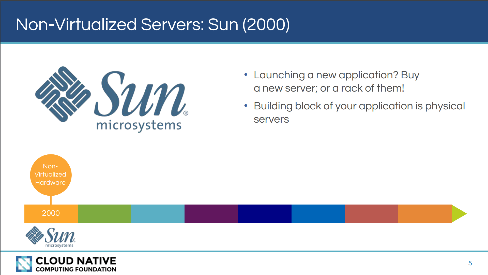
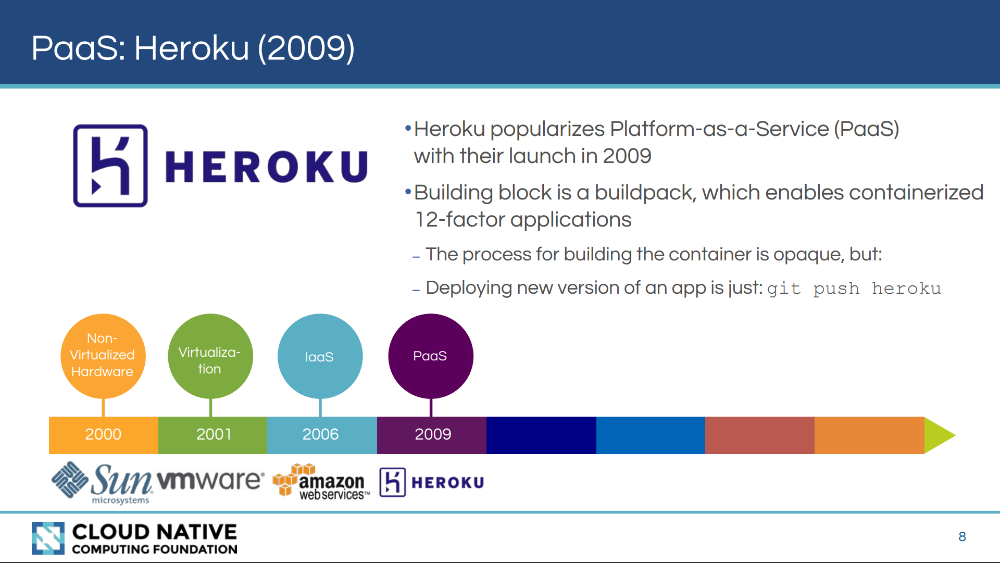
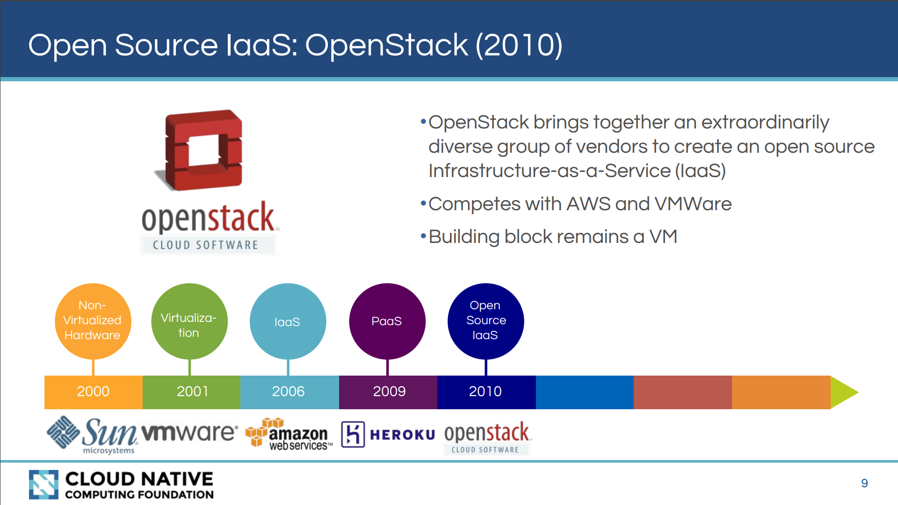
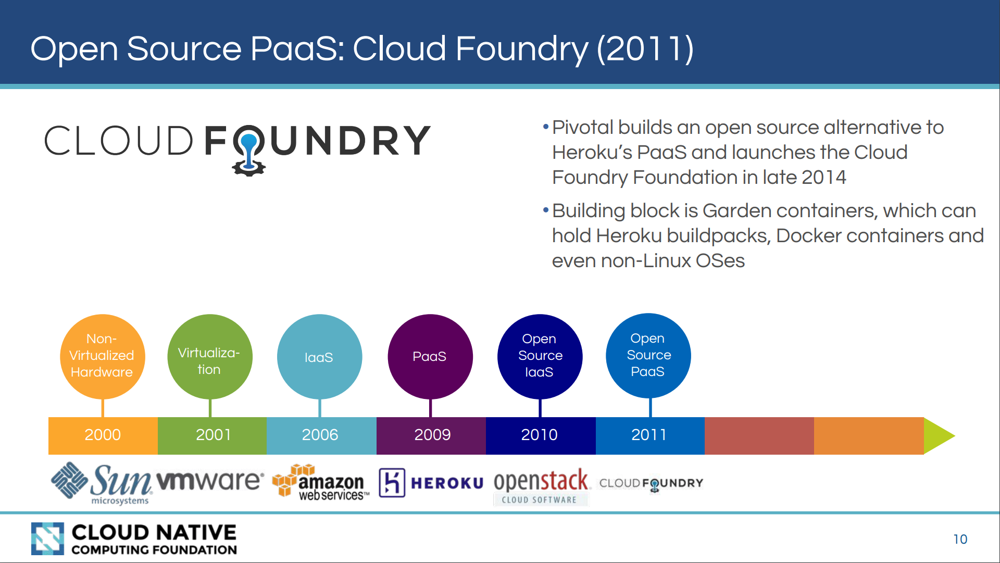
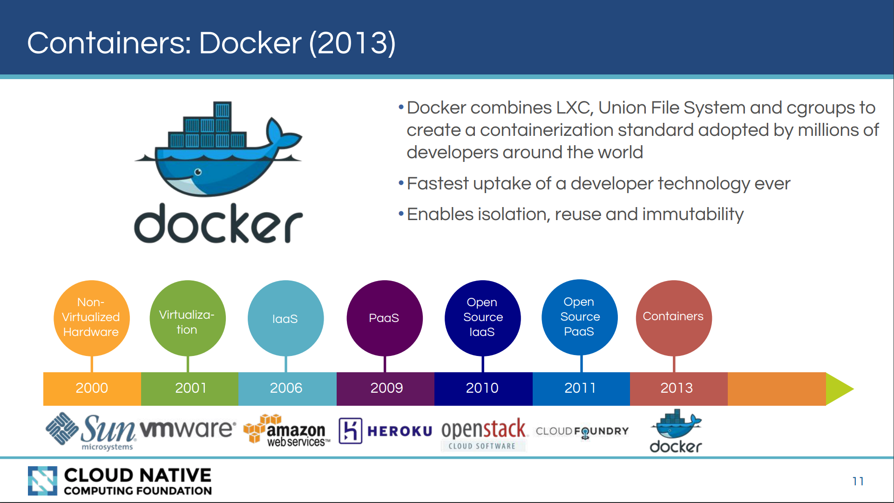
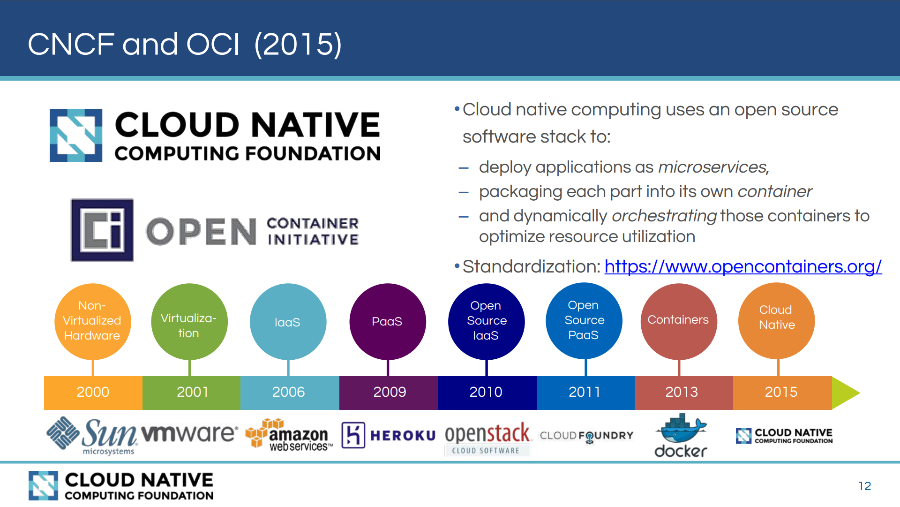

在介绍云原生之前，先看看过去20年间，云计算领域的发展演进历程。

## 二十年演进历程

在2000年，Sun时代，还没有虚拟服务器。当时如果要启用一个新的应用，需要购买一台或者一个机架的新服务器。应用程序的基本构建块是物理机。

2001年，VMWare带来了虚拟化计划，开始推广虚拟机（VM）的概念。通过虚拟机，可以在同一台物理机器上运行多个虚拟机，这意味着可以降低服务器的数量。此时的构建块变成了虚拟机。

在2006年，Amazon Web Service （也就是大家熟悉的AWS）通过提供 Elastic Compute Cloud （同样是大家熟悉的EC2）创立了 IaaS （Infrastructure-as-a-Service）市场。通过按时计费的方式租借服务器，将资本支出（Capex）转变为运营支出（Opex），这是云计算（Cloud Computer）的真正开始。此时构建块依然是虚拟机，称为Amazon Machine Image(AMI)。

背景介绍，**Capex Vs. Opex**：

- Capex = capital expenditure / 资本支出
- Opex =  operational expenditure / 运营支出

2009年，Heroku 推进 PaaS （Platform-as-a-Service）。此时构建块不再是虚拟机，而是 buildpack/构建包，集装箱式的12因素应用由此诞生。此时构建集装箱的过程依然是不透明的，但是部署应用的新版本就很简单了。

对应用的开发者而言，此时最大的变化是：终于可以更多的关注应用，而不必太考虑机器。

2010年，openstack 以汇集各种供应商的方式开创了IaaS的开源时代，和AWS、VMWare竞争。此时构建块还是虚拟机VM，但云计算已经开始进入开源时代。

2011年，继开源版IaaS之后，Pivotal推出了开源版PaaS Cloud Foundry，作为Heroku PaaS的开源替代品，并于2014年底推出了Cloud Foundry Foundation。构建块是Garden container，它可以容纳Heroku构建包，Docker容器甚至非Linux操作系统。（补充：Cloud Foundry是一个长期演进的体系，现在都已经支持k8s和Istio了）。

2013年，Docker组合LXC，Union File System和cgroups等Linux技术创建容器化标准，docker风靡一时，container逐步替代VM，云计算进入容器时代。容器技术应该是过去十年对软件开发行业改变最大的技术。容器开始了隔离，重用和不可变性的思潮，尤其是不可变性。

2015年，Cloud Native 出现，完全基于开源软件技术栈，Cloud Native 的重要理念是：以微服务的方式部署应用，每个应用都打包为自己的容器并动态编排这些容器以优化资源利用。

在2017和2018年，kubernetes 在和Mesos和Swarm的史诗大战中获胜，彻底击败对手，赢得容器编排市场的统治地位。以kubernetes为核心的CNCF Cloud Native生态系统也得以迅猛发展，云原生成为云计算市场的技术新热点。

## 演进总结

从上面演进历史，可以发现以下规律：

- 核心构建块的变化：

	从早期的物理服务器，通过虚拟机计划演进为虚拟机，再摆脱机器的限制缩小为构建块，最后通过容器化技术演进为目前的container

- 隔离单元：无论是启动时间还是单元大小，物理机、虚拟机、容器一路走来，实现了从重量级到轻量级的转变

- 不可变性：构建块越来越小，隔离单元越来越轻，不可变性由此出现，From pets to cattle 成为云计算时代的重要变化之一。

- 技术提供者：从闭源到开源，从单一供应商到跨越多个供应商

下图形象的概述了这二十年云计算的过程：从传统预制IT、托管到云，以及云的不同形态如IaaS、PaaS、SaaS等。

### 参考资料

- CNCF的介绍资料 [Cloud Native and Container Technology Landscape](https://events.static.linuxfound.org/sites/events/files/slides/(OSF_Mr.%20Chris%20Aniszczyk)CNCF%20(OS%20Forum%20Japan%202016).pdf)
- [What is XaaS? IaaS vs SaaS vs PaaS: what’s the difference](https://www.ispsystem.com/news/xaas)：对XaaS的概括介绍

