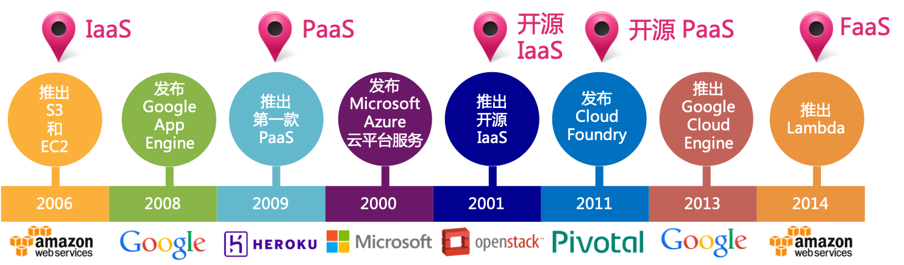

在介绍云原生之前，先看看过去几十年间，云计算领域的发展演进历程。

## 云计算的远古时代

云计算的历史事实上需要追溯到60多年前的计算机远古历史：

- 1955年，John McCarthy（备注：John McCarthy是Artificial Intelligence/人工智能一词的提出者）创造了一种在用户群中共享计算时间的理论。
- 1959年6月，在国际信息处理大会上克里斯托弗Christopher Strachey发表了《Time Sharing in Large Fast Computer》论文，提出了虚拟化概念。该文被公认为虚拟化技术的最早论述。
- 1965年8月，IBM推出System/360 Model 67 和 TSS 分时共享系统（Time Sharing System），通过虚拟机监视器（Virtual Machine Monitor）虚拟所有的硬件接口，允许多个用户共享同一高性能计算设备的使用时间，也就是最原始的虚拟机技术。

- 在20世纪60年代中期，美国计算机科学家 JCR Licklider 提出计算机互联系统(an interconnected system of computers)的想法。
- 1969年，在 JCR Licklider 的革命性创意的帮助下，Bob Taylor 和 Larry Roberts 开发了互联网的前身 ARPANET（Advanced Research Projects Agency Network），允许不同物理位置的计算机进行网络连接和资源共享。
- 1972年，IBM发布了名为VM（Virtual Machine）的操作系统。在90年代，虚拟机的使用开始流行
- 1974年，Popek和Goldberg发表了《Formal Requirements for Virtualizable Third Generation Architectures》提出了虚拟化准备的充分条件，指出满足条件的控制程序可以被称为虚拟机监视器Virtual Machine Monitor （VMM）：（1）一致性：一个运行于虚拟机上的程序，其行为应当与直接运行于物理机上的行为基本一致，只允许有细微的差异如系统时间方面；（2）可控性：VMM对系统资源有完全的控制能力和管理权限；（3）高效性：绝大部分的虚拟机指令应当由硬件直接执行而无需VMM的参与。
- 1978年，IBM获得了独立磁盘冗余阵列（Redundant Arrays of Independent Disks，RAID）概念的专利。该专利将物理设备组合为池，然后从池中切出一组逻辑单元号（Logical Unit Number，LUN）并将其提供给主机使用。虽然该技术直到1988年IBM才与加利福尼亚州立大学伯克利分校联合开发了第一个实用版本，但该专利第1次将虚拟化技术引入存储之中。

> “Time-Sharing”的背景：自20世纪50年代，人类使用大型计算机系统来处理数据。而在早期，大型计算机体积庞大而且价格高昂。为了提高投资回报率，购买大型机的组织开始实施“分时调度（time-sharing）”，然后从没有处理能力的终端访问大型计算机。“分时”理论可以充分利用可用的计算时间，可以用于为无力购买自己的大型机的小公司提供计算时间。

这里便陆续出现了云计算的基本前提：共享计算能力和共享网络，并出现了虚拟机，虚拟网络和早期基础设施。

但是在2000年前后虚拟化技术成熟之前，市场处于物理机时代。当时如果要启用一个新的应用，需要购买一台或者一个机架的新服务器。

## 虚拟化技术成熟

在2000年前后，虚拟化技术逐渐发展成熟：

- 1998年，VMware成立并首次引入X86的虚拟技术，通过运行在Windows NT上的VMware来启动Windows 95。
- 1999年，VMWare推出可在X86平台上流畅运行的第一款VMware Workstation，从此虚拟化技术终于走下了大型机的神话。之后，研发人员和发烧友开始在普通PC和工作站上大量使用该虚拟化解决方案。
- 1999年，IEEE颁布了用以标准化VLAN实现方案的802.1Q协议标准草案，从而可以将大型网络划分为多个小网络，使得广播和组播流量不会占据更多带宽的问题；同时，可以利用VLAN标签提供更高的网络段间的安全性。
- 2000年，IEEE颁布了虚拟专用网（Virtual Private Network）VPN标准草案，从而使得私有网络可以跨公网进行建立。
- 2000年，Citrix桌面虚拟化产品正式发布。
- 2001年，VMware发布了第一个针对x86服务器的虚拟化产品ESX和GSX，即ESX-i的前身。
- 2003年10月，Xen虚拟化项目首次面世推出了1.0版本，此时仅支持半虚拟化Para-Virtualization。之后，基于Xen虚拟化解决方案陆续被Redhat、Novell和Sun等的Linux发行版集成，作为默认的虚拟化解决方案。
- 2003年，Microsoft收购Connectix获得虚拟化技术进入桌面虚拟化领域，之后很快推出了Virtual Server免费版。
- 2005年，Xen 3.0发布，该版本可以在32位服务器上运行，同时该版本开始正式支持Intel的VT技术和IA64架构，从而使得Xen虚拟机可以运行完全没有修改的操作系统。该版本是Xen真正意义上可用的版本。
- 2006年10月，以色列的创业公司Qumranet在完成了虚拟化Hypervisor基本功能、动态迁移以及主要的性能优化之后，正式对外宣布了KVM的诞生。同年10月，KVM模块的源代码被正式接纳进入Linux Kernel，成为内核源代码的一部分。备注：Qumranet在2008年被RedHat收购。
- 2009年4月，VMware推出业界首款云操作系统VMware vSphere。

云计算的重要里程碑之一是2001年VMWare带来的可用于X86的虚拟化计划。通过虚拟机，可以在同一台物理机器上运行多个虚拟机，这意味着可以降低服务器的数量，而且速度和弹性也远超物理机。

## 基于虚拟机的云计算

在虚拟化技术成熟之后，云计算市场才真正出现，此时基于虚拟机技术诞生了众多的云计算产品，也陆续出现了IaaS、PaaS等平台和公有云、私有云、混合云等形态：

- 2006年，AWS推出首批云产品Simple Storage Service (S3)和Elastic Compute Cloud（EC2），使企业可以利用AWS的基础设施构建自己的应用程序
- 2008年4月，Google App Engine发布，是 Google 管理的数据中心中用于 WEB 应用程序的开发和托管的平台。
- 2009年，Heroku 推出第一款公有云 PaaS （Platform-as-a-Service）
- 2010年1月，微软发布 Microsoft Azure云平台服务。备注：Microsoft Azure 于2008年宣布。
- 2010年7月，Rackspace Hosting和NASA联合推出了一项名为OpenStack的开源云软件计划
- 2011年，Pivotal推出了开源版PaaS Cloud Foundry，作为Heroku PaaS的开源替代品，并于2014年底推出了Cloud Foundry Foundation。
- 2013年底，Google 推出 Google Compute Engine （GCE）正式版。备注：GCE的测试版本于2008年发布，预览版于2012年发布。
- 2014年，AWS推出 Lambda，允许在AWS中运行代码而无需配置或管理服务器，即Faas/Serverless。

在这期间，出现了云计算的多个重要里程碑：

1. IaaS的出现：通过按时计费的方式租借服务器，将资本支出（Capex）转变为运营支出（Opex），这使得云计算得以大规模兴起和普及。
2. PaaS的出现
3. 开源IaaS的出现：云计算已经开始进入开源时代
4. 开源PaaS的出现
5. FaaS的出现

补充术语介绍，**Capex Vs. Opex**：

- Capex = capital expenditure / 资本支出
- Opex = operational expenditure / 运营支出

## 容器的兴起和编排大战

2013年，在云计算领域发生了一件影响深广的技术变革：容器。

容器技术可以说是过去十年间对软件开发行业改变最大的技术，而从虚拟机到容器，整个云计算市场发生了一次重大变革，甚至是洗牌。基于容器技术的容器编排市场，则经历了Mesos、Swarm、kubernetes三家的一场史诗大战，最终以kubernetes全面胜利而告终：

- 2008年，LXC（Linux Container）容器发布，这是一种内核虚拟化技术，可以提供轻量级的虚拟化，以便隔离进程和资源。LXC是Docker最初使用的具体内核功能实现
- 2013年，Docker发布，组合LXC，Union File System和cgroups等Linux技术创建容器化标准，docker风靡一时，container逐步替代VM，云计算进入容器时代
- 2014年底，CoreOS正式发布了CoreOS的开源容器引擎Rocket（简称rkt）
- 2014年10月，Google 开源 kubernetes，并在2015年捐赠给 CNCF
- 2015年6月，OCI组织成立，旨在制定并维护容器镜像格式和容器运行时的正式规范，以便在不同的操作系统和平台之间移植
- 2015年7月，Google联合Linux基金会成立了CNCF组织，kubernetes 成为 CNCF 管理的首个开源项目
- 2015年，CNCF组织开始力推 Cloud Nativ ，完全基于开源软件技术栈，Cloud Native 的重要理念是：以微服务的方式部署应用，每个应用都打包为自己的容器并动态编排这些容器以优化资源利用
- 2017年9月，Mesos宣布了对Kubernetes的支持
- 2017年10月，Docker宣布将在下一版Docker，将同时支持自家调度引擎Swarm和来自Google的调度平台Kubernetes
- 2018年3月，Kubernetes 从 CNCF 毕业，成为 CNCF 第一个毕业项目

这里有两个重要的里程碑：

1. 2013年，Docker发布，容器逐步替代VM，云计算进入容器时代
2. 2017年底，Kubernetes 赢得容器编排的胜利，云计算进入 Kubernetes 时代

在容器编排大战期间，以 kubernetes 为核心的CNCF Cloud Native生态系统也得以迅猛发展，云原生成为云计算市场的技术新热点。

## 云计算演进总结

云计算的发展演进历史，有以下规律：

- 核心构建块的变化：

  从早期的物理服务器，通过虚拟化技术演进为虚拟机，再摆脱机器的限制缩小为构建块，最后通过容器化技术演进为目前的container

- 隔离单元：无论是启动时间还是单元大小，物理机、虚拟机、容器一路走来，实现了从重量级到轻量级的转变

- 供应商：从闭源到开源，从单一供应商到跨越多个供应商

下图形象的概述了这二十年云计算的演进过程：从传统预制IT、托管到云，以及云的不同形态如IaaS、PaaS、SaaS等。

对于XaaS的一路演进，可以简单归纳为：

- 有了IaaS，客户不用关注物理机器
- 有了PaaS，客户不用关注操作系统
- 有了FaaS，客户不用关注应用程序

在这过去的二十年间，云计算几乎重新定义了整个行业的格局，越来越多的企业开始降低对IT基础设施的直接资本投入，不再倾向于维护自建的数据中心，而是开始通过上云的方式来获取更强大的计算、存储能力，并实现按时按需付费。这不仅仅降低IT支出，同时也降低了整个行业的技术壁垒，使得更多的公司尤其是初创公司可以更快地实践业务想法并迅速推送到市场。

### 参考资料

- CNCF的介绍资料 [Cloud Native and Container Technology Landscape](https://events.static.linuxfound.org/sites/events/files/slides/(OSF_Mr.%20Chris%20Aniszczyk)CNCF%20(OS%20Forum%20Japan%202016).pdf)
- [What is XaaS? IaaS vs SaaS vs PaaS: what’s the difference](https://www.ispsystem.com/news/xaas)：对XaaS的概括介绍
- [漫画趣味图解云计算的起源](https://cloud.tencent.com/developer/article/1149422)
- [云计算的前世今生——云计算发展大事件](https://zhuanlan.zhihu.com/p/33608591): 梳理得较为全面的云计算大事记文章，值得收藏和分享
- [坐看云起时，谈笑无还期](https://insights.thoughtworks.cn/cloud-computing/)

