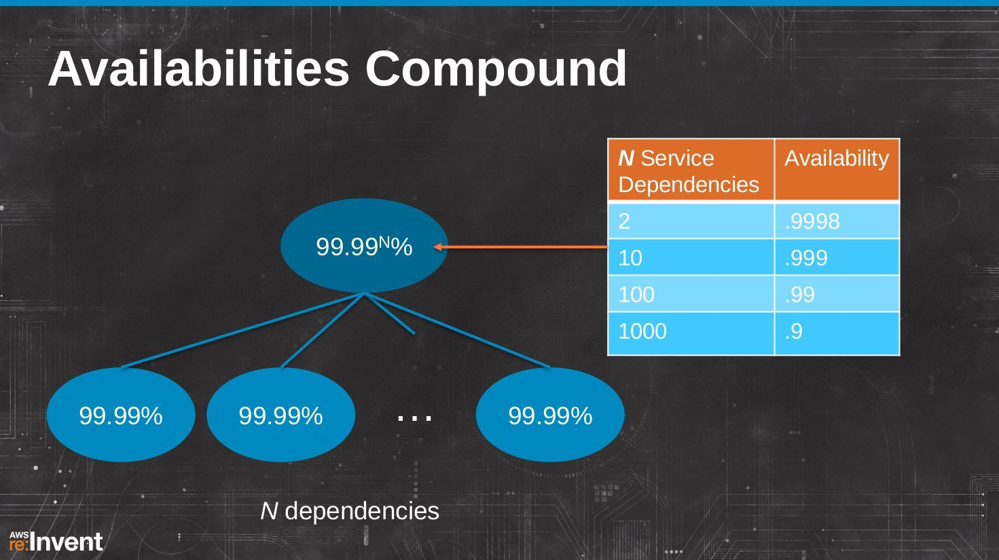
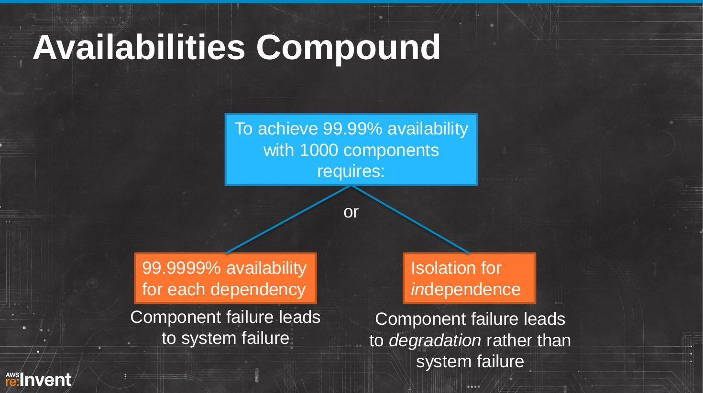
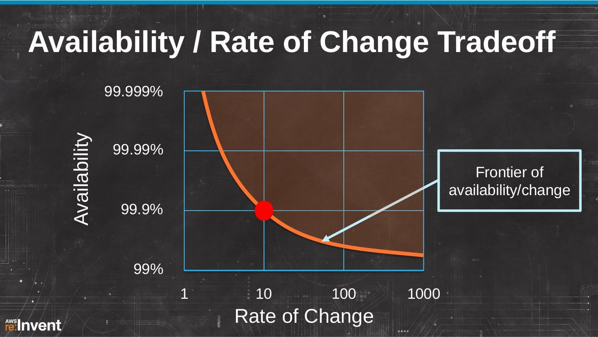

以容器方式打包的应用程序实现了 dev/prod 的一致性，促进代码和组件重用并简化运维。

我们以Netflix公司的例子来看，Netflix 给自己定的目标:

- Availability：可用性优先考虑，要求4个99（99.99%）
- Scale：然后是可扩展性，满足业务增长是硬性需求
- Performance：再是性能

但是当服务的依赖增加时，可用性会下降，图中表格显示可用性为99.99%的服务在服务依赖数量增加时可用性下降的趋势。

为了在有1000个组件的情况下继续保持4个9的可用性，有两条途径：

- 如果组件失败会导致系统失败，则要求每个组件达到6个9，这个难度很大，尤其成本会无法控制
- 或者，如果组件失败可以降解而不是导致系统失败，则可以隔离非依赖服务的影响

而仅有Availability, Scale, Performance 是不够的! 还必须实现快速迭代，提高变更速度。而变更会导致bug，变更速度对可用性造成负面影响：

可用性和变更速度之间的矛盾: 当变更速度增加时，可用性下降。要提高可用性，则要求降低变更速度：

但是现在的目标是，必须改变曲线，同时实现提高可用性和增加变更频率：

这就必须打破导致级联系统失败的级联依赖，实现子系统隔离: 让失败只发生在一个组件中，而绝不导致级联系统失败。

而子系统隔离需要实现：

- 具备超时和故障转移能力的冗余系统：当超时时可以有默认相应作为fallback
- 金丝雀推出 （Canary Push）
- 蓝绿部署：应该就是现在常说的蓝绿部署
- 灰度发布：先小范围试错，验证OK再全面上线
- Zone Isolation：区域隔离，以应对基础设施失败，如电力故障
- Region Isolation：地域隔离，通过DNS等技术手段切换Region

### 参考资料

- [Netflix Development Patterns for Scale, Performance & Availability](https://www.slideshare.net/AmazonWebServices/dmg206) ，来自Netflix，2013年

